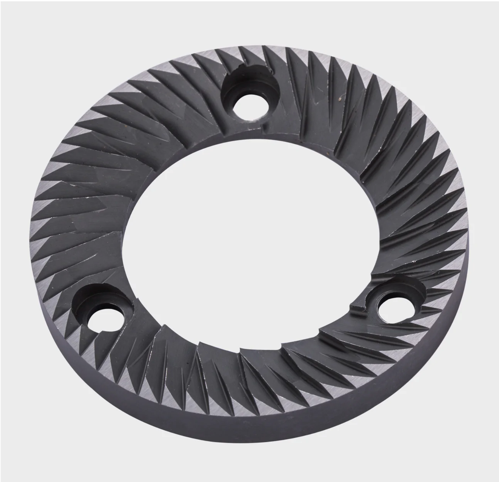
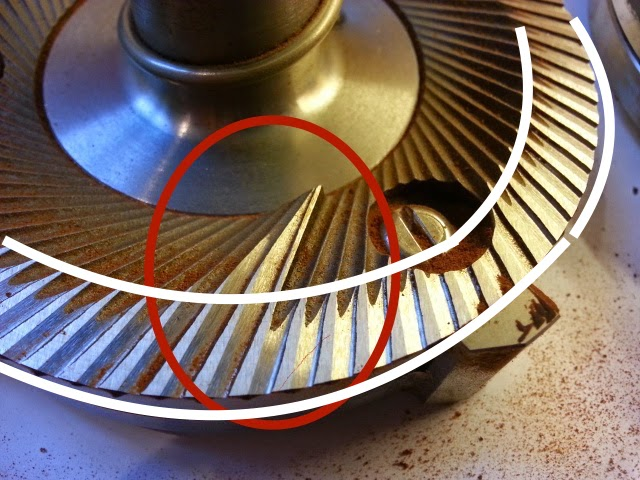
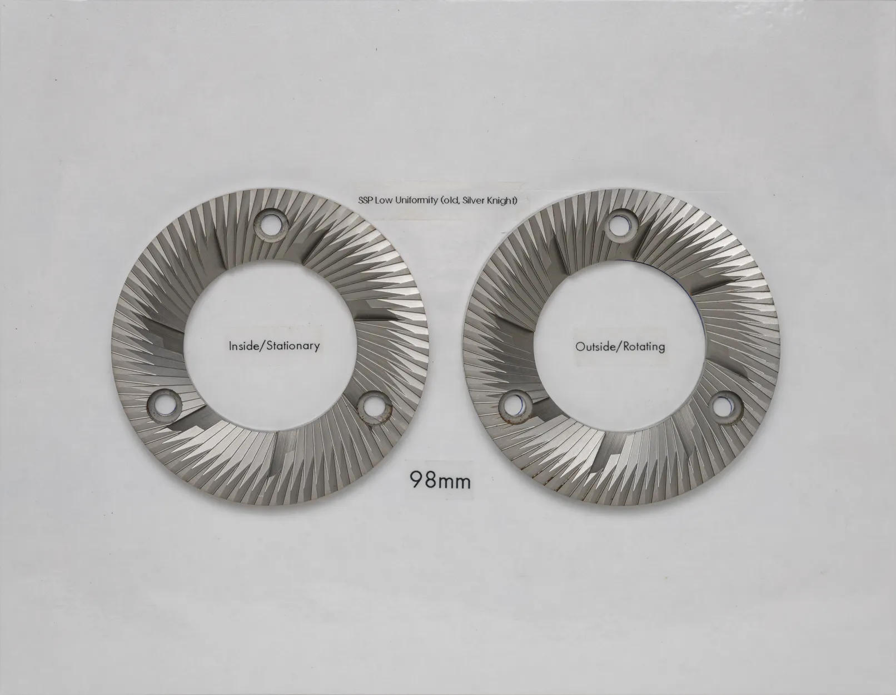
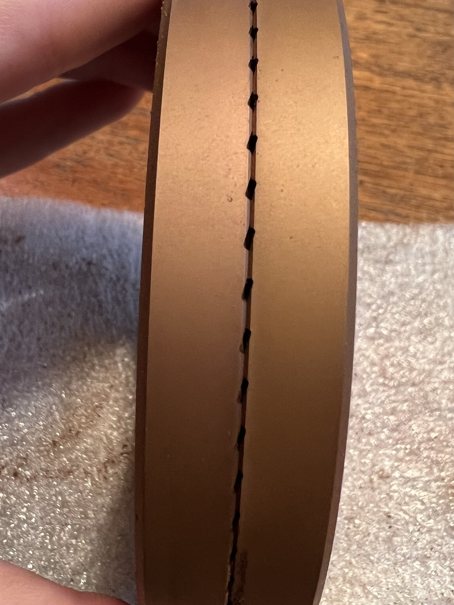

# The Burr Catalog
## An attempt to understand the naming scheme

Burrs are what makes your coffee beans turn into a usefull substance to make coffee out of, be it espresso, pour over, moka pot or Aeropress. The 'grinder' itself is only a tool to enable the burrs to do their thing. As long as any grinder A, B or C is able to spin burr X in a good fashion, theoretically, they should perform identically in the cup. Atleast that is the notion behind high perfomance burr manufacturers. Other factors the grinder influences are RPM, [Burr alignment](#link), bean feed speed, static-screen (causes 'regrinding') and possibly many more.
Don't forget to factor in workflow in any future grinder purchases either. 

Before continuouing this quest for the perfect equipment, [watch Lance Hedricks truthbomb video](#https://www.youtube.com/watch?v=iiip3C9l2tk)

## High perfomance burrs

This wiki page contains an overview of existing high-perfomance burrs. Many of which are not made by the OEM of the grinder, but a third party. SSP (Sim Sung Precision) Grinding is a big player here. We also cover some exceptional burrs from OEM. Mahlkönig / Ditting has a long track record of designing excellent burrs, which look like the basis for many SSP burrs (not getting into legal issues here).

There are hundreds of 'standard-espresso' design burrs. We won't cover those, since most of them perform relatively the same, creating a lot of fines and not a very uniform, or unimodal grind.

#### Taste
This being a minefield of contradictions.. I try my best.

Burrs change big beans into small particles. The _uniformity_ (size, shape) of these particles have big impact in taste. Burrs can also be _unimodal_ or _bimodal_ (mostly particles of size X or mostly particles of size X and Y). They ofcourse also can be none of the above. 

Again _Generally_ more fines give more body/mouthfeel, and less flavor seperation or 'more mudiness'. Less fines give less body/mouthfeel / a 'thin' shot, and more flavor seperation or _clarity_ (minefield)

Apart from the 'safe space' of any burr below, a lot of burrs can be dialed to a _different taste_, meaning that you, the user, still have a lot of influence on what comes out apart from the machine. There are limits ofcourse to what you can create, a burr is just one of the tools in your quiver. 

#### Back to the burrs

What we mean by a 'standard' espresso burr

_"Standard espresso burr" - this one is from ItalMill (DF64 stock)_

We also won't cover conical burrs, mainly due to lack of availability third party burr options. Short mention here however is that most flatburrs give a more uniform grind, with less fines than most conical burrsets.

## Identifying burrs

#### How to identify burrs? Let's start with the basis:

- Outer diameter/OD (64mm, 83mm, 98mm etc)
- Mounting (2 hole, 3 hole, blind)
- Geometry (Some have 'names' which can be _very_ confusing and contradictory)
- Coating/material ("Red Speed" - "SilverKnight" - "Titanium" - "Tungsten Carbide") 

#### Geometery basics:
Burrs consist of different parts, we name them to easier talk about it.

Prebreakers marked Red -- Flats marked white:

Prebreakers & Flats

_Prebreakers & flats on a standard EK43 98mm burr_

## Contents

[ table ] 

## Overview of 64mm burrs

### SSP 64 HU
The SSP 64 High Uniformity is an espresso focused burr, meaning it can easily grind _fine enough_ for espresso, and be easy to dial in. 64 HU gives a full-bodied shot, while it also provides more flavor seperation than stock burrs, making it an excellent option for people looking for tasty espresso, that still provides the body/mouthfeel they're looking for. Not considered as _high clarity_ - more a good middleground between body/mouthfeel and excellent flavors.

Images

 is considered the _high clarity burr_ in the 64mm landscape. It gives good flavor seperation at the cost of _thin shots_ / a lack of body/mouthfeel. Acids can get very pronounced which might not be to your liking, however this can express the fruity notes better. Not for everyone! Don't fall into the _search for clarity rabbithole_. Can be very 'harsh' 
 

Images

 the flats. The Brew has more sawtooth, the MP has more zigzag or complete flat in some revisions.

Images

Silver: 64 BREW, Red 64 MP (note there are still many other revisions of MP)

In my opinion the bets *looking* burr, if that adds anything. An adaptation of the Ditting 80mm Lab Sweet burrs found in the Ditting 804 and 807 'LS' to fit common 64mm mounting. Also considered the 'sweet spot' between body and clarity (minefield). More 'soft' and 'sweet' compared to MP and HU respectively. 

Images

The 'Original' cast burrs from Ditting. Also come in this same geometry but non-cast. Found in the 804 and 807LS and also fit the Mahlkonig PEAK and E80S. 

Images

Images

![Image of EG1 80 Core](../images/Burr_catalog/EG1CORE_FRONT.jpeg

![Image of EG1 80 Ultra](../images/Burr_catalog/EG1ULTRA_FRONT.jpeg

## Overview of 83mm burrs
### SSP 83 HU
SSP 83mm HU. The 'Original' 83mm SSP burr. Before the DF83 came out this size didn't get much attention from HanSung. Compared to 64HU, 83 HU shifts more towards flavor saparation, while still retaining the body. Please add more info here, since I know jack sh*t about it.

Images

_LU vs HU outer edge_

### SSP 98 LU

Images

### SSP 98 ULF / Brew / wtf?
All I know its _very_ low fines, and therefore not really suited for espresso grinding. 

Images

### EK43 pre 2015 (now considered as SSP 98 'cast' again)
Empty

Images

empty

### EK43 post 2015 
empty

Images

empty

