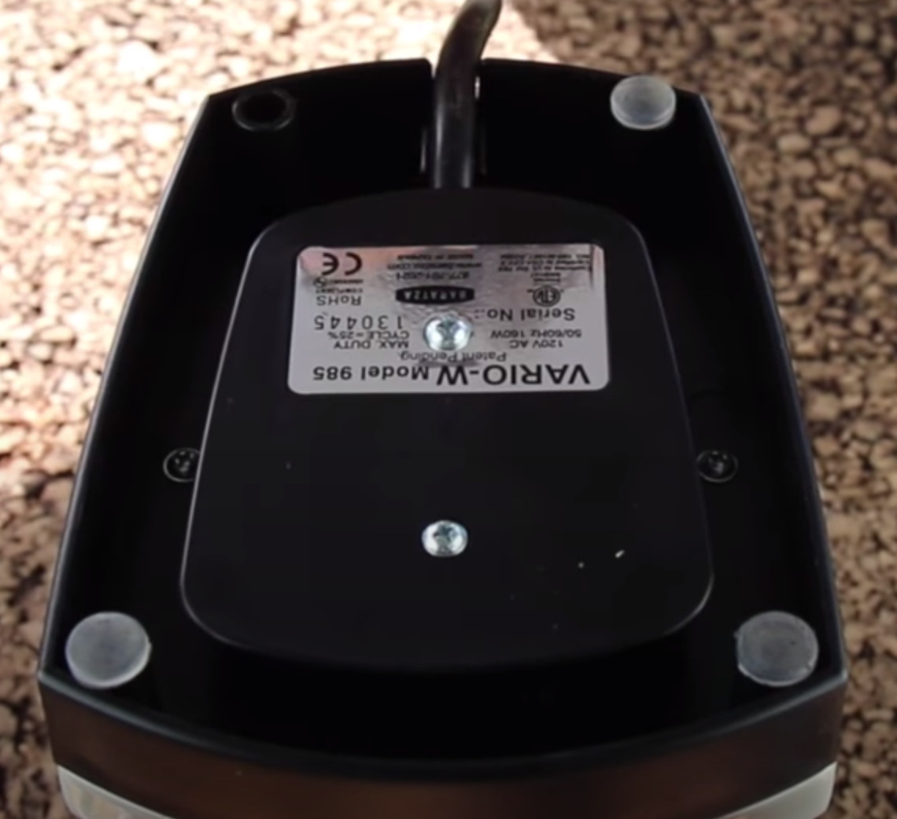
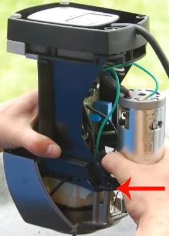
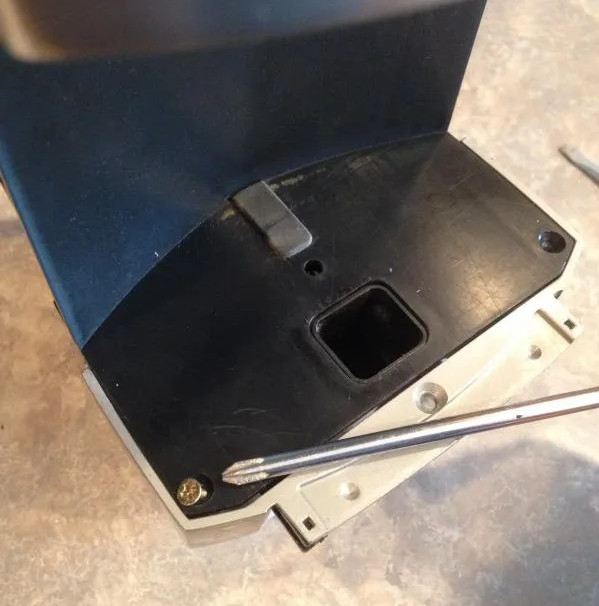
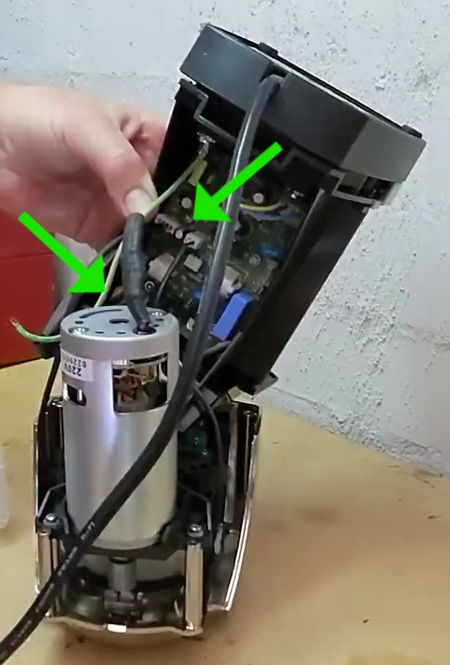
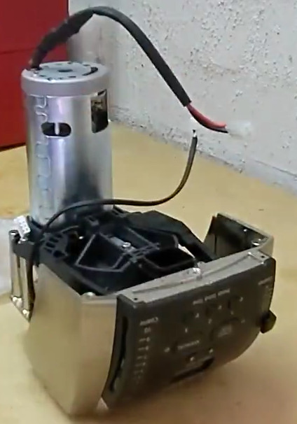
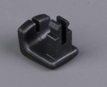
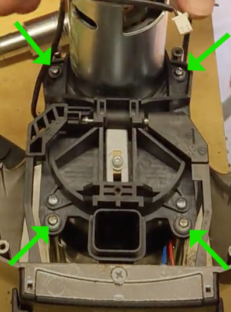
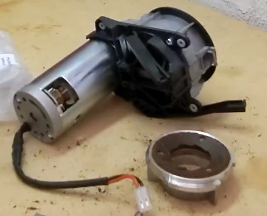

# Vario Disassembly
The Vario is quite straightforward to service. Baratza themselves provide videos on youtube for a number of procedures.

* [How to: Remove the Case Vario, Vario W](https://youtu.be/8WEKzzrZu98)
* [How to: Install Lever Arm Shims Vario, Vario W](https://youtu.be/xPdS8NDi4Bs)
* [How to: Drive belt and pulley replacement Vario, Vario W](https://youtu.be/JhoMt84jxXs)

The full disassembly of a Forte can be followed here: 

* [Baratza Forte Grind Assembly Removal](https://youtu.be/F-6fTjt8Ics)

## Disassembly Steps

1. Unplug the Vario from power!

1. Tip out any beans from the hopper then remove the hopper itself.

1. Remove the back two screws on the bottom of the unit (under the rubber feet) to remove the back cover. On the Forte there is also a screw near the top of the back cover that will also need to be removed. Then the back cover should pull straight off.

1.  Remove the two phillips-head screws beside the motor. One of these should have an earth wire under it, and both should have star washers - try not to lose these.

1. Remove the two phillips-head screws either side of the exit chute.

1. The motor / grind chamber / top housing should now start to lift free from the base.
There will be three cables attached to the circuit board that need to be unplugged, the larger motor cable and two smaller control cables.
Ensure you grab the connectors themselves and wiggle side-to-side to pull them out, avoid pulling on the cables. Some people prefer to use side-cutters to gently grab the control cable connectors to wiggle and remove.

1. At this point the base should be separated, leaving you with the grind chamber and top housing.

1. To remove the top housing, you first need to remove the grind adjustment lever handles.
On the Vario, these are just push on.

    
    
    They can be gently levered out, either by pulling with fingers or with a flat screwdriver or similar.

    On The Forte they're screwed in however. You will need to remove the front screen by taking out the screw under the screen, then the screws on the inside back of the handles can be accessed through the screen opening.

1. Once the lever handles are off, you can remove the 4 outermost screws on the bottom of the grind chamber to separate it from the top housing.

1. The grind chamber should now lift free from the top housing. The top burr carrier can be removed by twisting it by its three wings clockwise.

