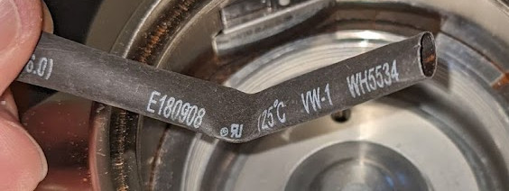
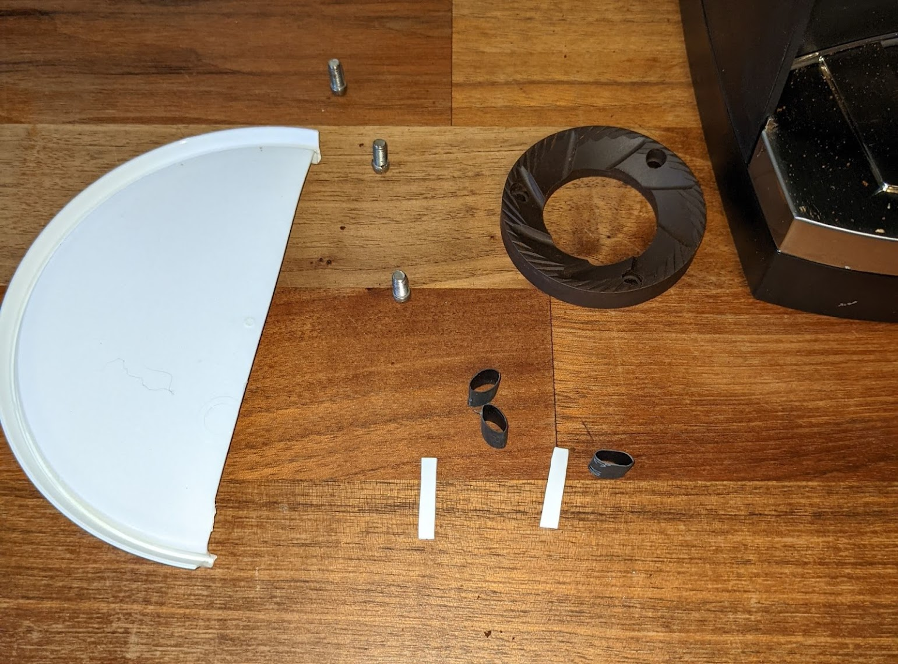
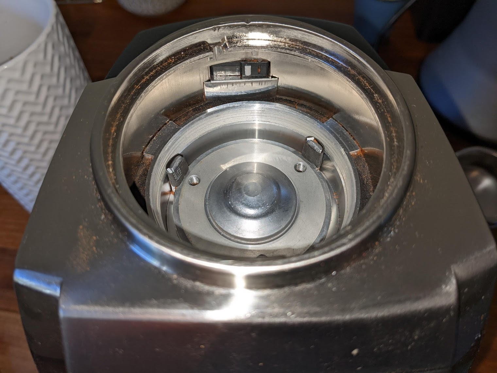
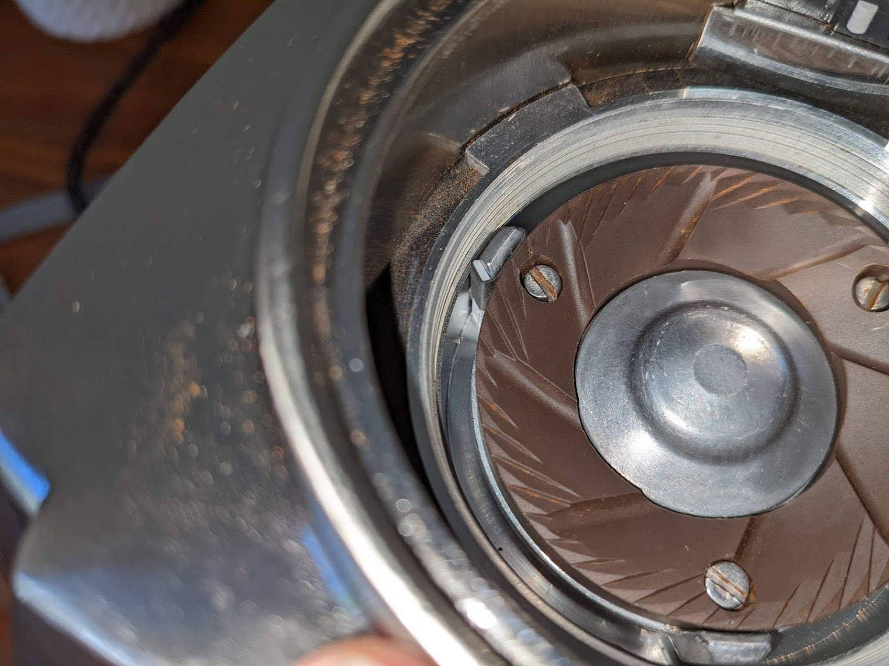

# Vario Retention
The Vario has pretty decent retention out of the box, depending on who you ask it generally retains 0.5g to 2g depending on the grind size. This can be improved upon however.

## Flapper Mod
The first and simplest fix is to get rid of the rubber flap on the exit chute in the grinder. 

This flap is designed to catch grinds inside the grinder to disperse static to help stop the grinds spraying all over your bench top while in use. Unfortunately, this flap also causes some grinds to be held inside the grinder behind the flap, not in your portafilter.

Removing the flap dramatically improves the retention of the grinder, reducing it to typically 0.1g - 0.2g, at the likely expense of a messier bench when directly grinding into portafilter (and losing another 0.1g - 0.2g spraying around). 
This static issue can be addressed by other techniques though like grinding into the bin instead of portafilter, or RDT.

In the vario we don't want to completely remove the flap as it's partially used as a gasket between the grind chamber and the exit chute. Instead, we can flip it around so the flap is outside the chute, rather than inside.

For more background see https://www.home-barista.com/grinders/single-dosing-baratza-vario-success-t32370.html

To perform the flap flip, we need to partially disassemble the grinder. 

Review the steps described in [Vario Disassembly](./vario_disassembly.md)

To access the flap you only need to follow this the point of removing the base from the top/grind chamber. Technically you don't need to disconnect the cables, but it can make it easier if you do.

In the picture for "Step 9: Removing the top housing" you should be able to see the exit chute. 

Without removing the top housing or lever handles you should be able to grab the end of the chute and wiggle / pull it down off the grind chamber.

Note there is a rubber gasket around the end of this chute (missing in above image) that's easily lost if you don't keep an eye on it!

On the inside top of the chute the rubber flap can be seen:

The rubber flap can be popped of the two spikes holding it on, then pushed back on them around the other way

Then just slide the chute back up into the grind chamber, taking care it follows back up onto the slide guides either side of the entrance to the chute.

Re-assemble the rest of the grinder in the reverse of disassembly.

Now your grinds should come out dramatically fluffier, with far less retention.

## Vario Sweeper Upgrade
The sweepers around the lower burr in the Vario are responsible for collecting the fresh grinds and directing them to the exit chute. Unfortunately there's a fair amount of gap around them, between this and the bevilled top of the sweeper arms a ring of grinds are typically left behind around the lower burr in the grind chamber. 

On top of this there can be extra coffee left under the lower burr carrier, particularly at finer (espresso) grind settings as the gap upder the burrs is increased as the burr is lifted for a finer grind. 

One workflow tip for users who are single-dosing is to grind at the desired setting, then at the end move the macro lever right down to 10 and back up again, this will force the under-burr sweepers to the bottom of the chamber to help clear it out. 

This doesn't help with the ring of grinds seen above however, and doesn't work if you've got a hopper full of beans.

Whether the ring is just retention or exchanged with new grinds during use is up for debate, but regardless it would be better to avoid entirely if possible.

On solution to this is to make the sweepers larger, so the gap between them and the chamber is reduced. 

This can be done easily with short sections of 6mm heatshrink tubing. You'll want this to be as thin-walled as possible so it can fit between the sweeper arms and the burrs, so avoid the stuff with glue inside.

I generally only grind for espresso (macro 2) and very occasionally Aeropress (~ macro 6) so I also extended the sweepers down a bit deeper too.

If you grind for filter / macro=9 or 10 you can just skip the extensions.

Start by cleaning out the grind chamber (brush / vaccuum) and unscrew the lower burr. 

With the burr out, make sure you really clean out all grinds from the lower carrier and all the nooks / screw holes on the burr itself - you don't want any grinds left under the burr when you reassemble or the alignment will be compromised.

Cut some short pieces heatshrink the same height as the burr.

If desired, cut out some sweeper extenders from some thin plastic, I used the lid of a 1kg yoghurt container (similar to ice cream container material)

My extension pieces were 2.5mm wide by 13mm long.

Slip the heatshrink onto the sweeper arms / lower burr carrier posts and feed the extensions down the side of them. 

Make sure the extensions are on the leading face of the arms (burr rotates counter-clockwise) so the angle of them is going to push grinds towards the outside of the chamber.

Set the macro lever to one setting courser then you ever want to use, then push the extensions down until they just touch the bottom of the chamber.

Then install the burr again, being careful not to crush the heatshrink.

Note: I could only fit heatshrink on two of the arms, I could not get the burr on with all three. So I've only extended these two. It would probably work pretty well with only one extended really, though the more the better I figure. 

While attempting to fit the burr with all three I removed my lower carrier from my machine, but you shouldn't need to normally. This is what it looks like up close however:

With the burr screwed back in you can now shink the tubing. I used a hairdriver on its hottest setting. A heat gun would work well too, just be careful not to melt the plastic extenders or anything else around the grind chamber.

It's important to not shrink the tubing without the burr in place as the material gets thicker as it shrinks, we don't want extra thickness between the arms and the burr. 

With the heatshrink and extenders in place I'm pretty sure they still weren't actually touching the walls of the grind chamber on mine, but gee they were close. Certainly close enough to really minimise any possible retention.

With that, it's all done! Just re-install the top burr and hopper and make yourself a celebration coffee!
