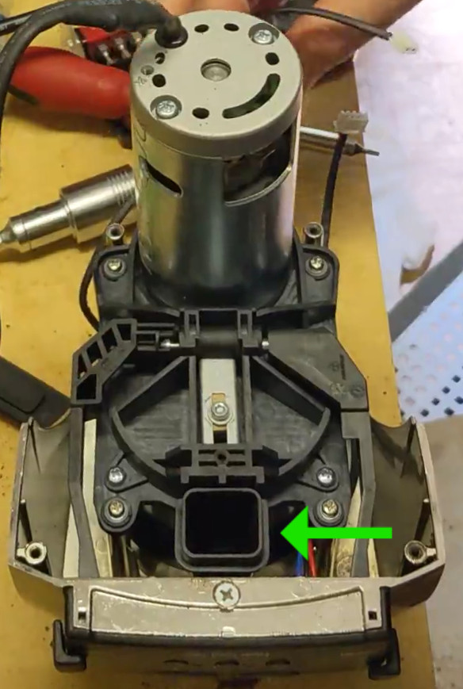
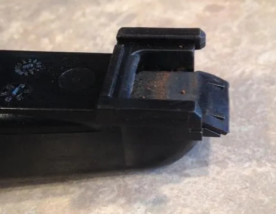
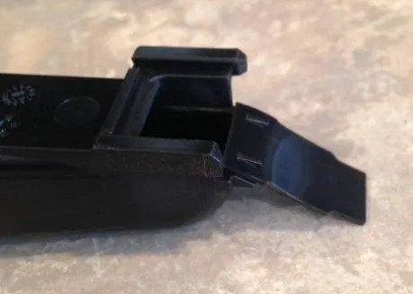
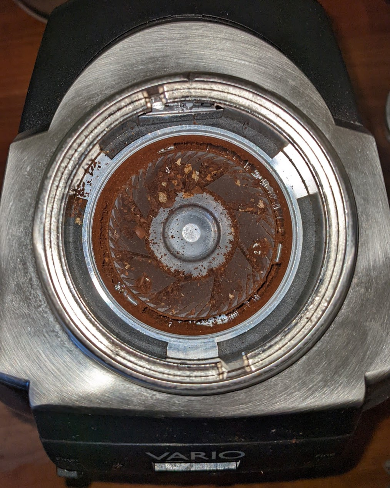
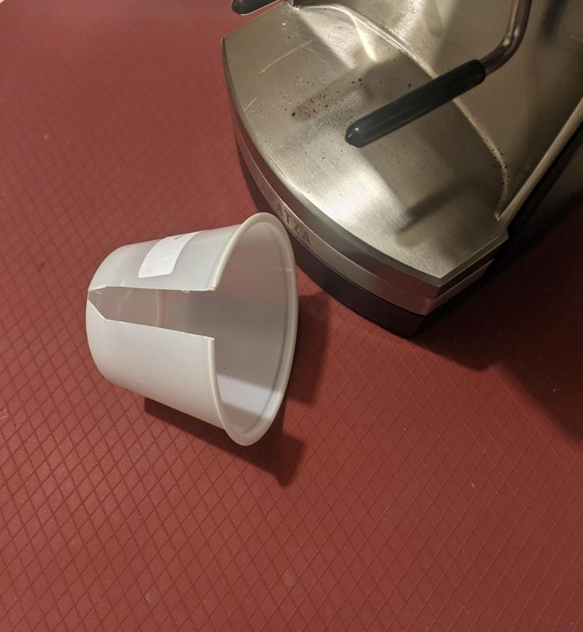
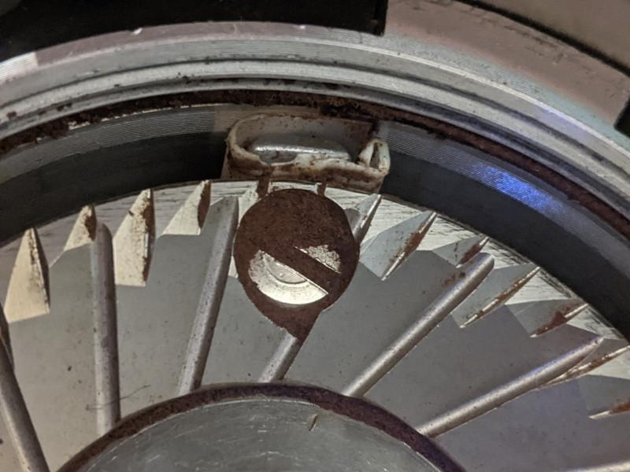

# Vario Retention
The Vario has pretty decent retention out of the box, depending on who you ask it generally retains 0.5g to 2g depending on the grind size. This can be improved upon however.

## Flapper Mod
The first and simplest fix is to get rid of the rubber flap on the exit chute in the grinder. 

This flap is designed to catch grinds inside the grinder to disperse static to help stop the grinds spraying all over your bench top while in use. Unfortunately, this flap also causes some grinds to be held inside the grinder behind the flap, not in your portafilter.

Removing the flap dramatically improves the retention of the grinder, reducing it to typically 0.1g - 0.2g, at the likely expense of a messier bench when directly grinding into portafilter (and losing another 0.1g - 0.2g spraying around). 
This static issue can be addressed by other techniques though like grinding into the bin instead of portafilter, or RDT.

In the vario we don't want to completely remove the flap as it's partially used as a gasket between the grind chamber and the exit chute. Instead, we can flip it around so the flap is outside the chute, rather than inside.

For more background see https://www.home-barista.com/grinders/single-dosing-baratza-vario-success-t32370.html

To perform the flap flip, we need to partially disassemble the grinder. 

Review the steps described in [Vario Disassembly](./vario_disassembly.md)

To access the flap you only need to follow this the point of removing the base from the top/grind chamber. Technically you don't need to disconnect the cables, but it can make it easier if you do.

In the picture for "Step 9: Removing the top housing" you should be able to see the exit chute. 

Without removing the top housing or lever handles you should be able to grab the end of the chute and wiggle / pull it down off the grind chamber.

Note there is a rubber gasket around the end of this chute (missing in above image) that's easily lost if you don't keep an eye on it!

On the inside top of the chute the rubber flap can be seen:

The rubber flap can be popped of the two spikes holding it on, then pushed back on them around the other way

Then just slide the chute back up into the grind chamber, taking care it follows back up onto the slide guides either side of the entrance to the chute.

Re-assemble the rest of the grinder in the reverse of disassembly.

Now your grinds should come out dramatically fluffier, with far less retention.

## Vario Grind Chamber retention
The sweepers around the lower burr in the Vario are responsible for collecting the fresh grinds and directing them to the exit chute. Unfortunately there's a fair amount of gap around them, between this and the bevilled top of the sweeper arms a ring of grinds are typically left behind around the lower burr in the grind chamber. 

On top of this there can be extra coffee left under the lower burr carrier, particularly at finer (espresso) grind settings as the gap upder the burrs is increased as the burr is lifted for a finer grind. 

One workflow tip for users who are single-dosing is to grind at the desired setting, then at the end move the macro lever right down to 10 and back up again, this will force the under-burr sweepers to the bottom of the chamber to help clear it out. 

This doesn't help with the ring of grinds seen above however, and doesn't work if you've got a hopper full of beans.

Whether the ring is just retention or exchanged with new grinds during use is up for debate, but regardless it would be better to avoid entirely if possible.

A solution to this is to make the sweepers larger, so the gap between them and the chamber is reduced. 

@bakafish on home-barista.com cut little strips of "name card" and attached them to the side of the sweeper with double sided tape.
https://www.home-barista.com/grinders/baratza-vario-post-flapper-mod-retention-t68589-10.html#p751751

On the same thread, @baldheadracing cut a strip of plastic from a disposable cup and wrapped that around the sweeper.

A similar modification has been attempted by using heatshrink tubing to attach plastic strips the the sweepers. However a few weeks later the motor in that Vario burnt out. While the reason is unconfirmed, there's a possibility
that if the sweepers get extended too close to the walls of the chamber, grinds might jam in between adding strain
to the motor. This is a risk that should be taken into account in any modifications in this area.
