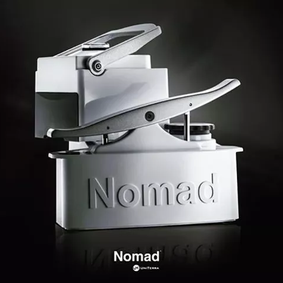
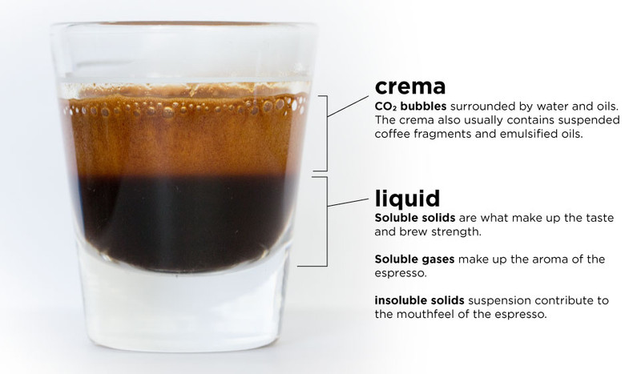
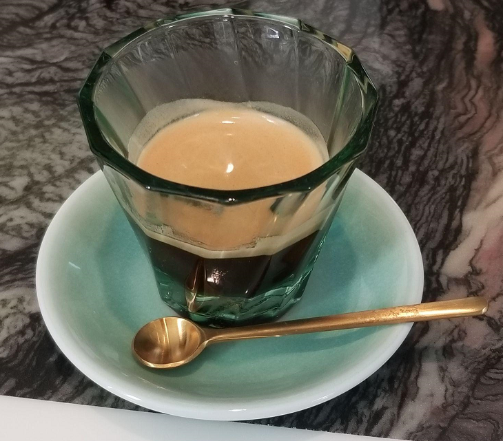
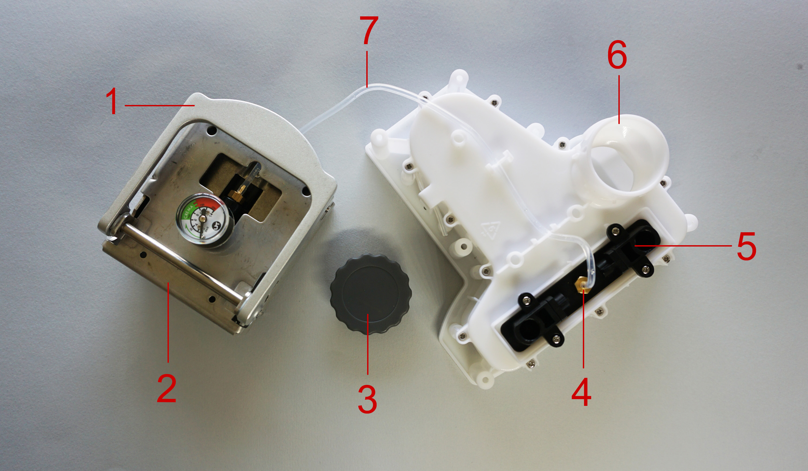
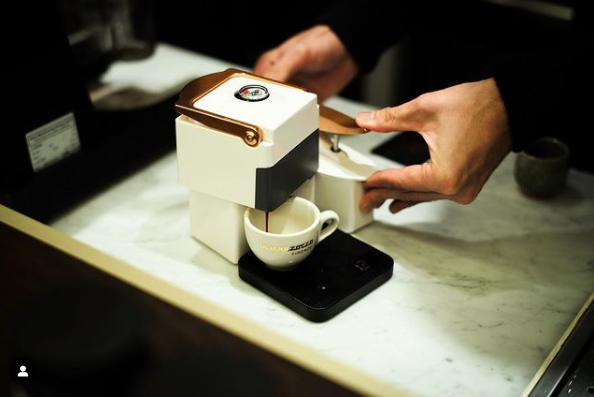

# Uniterra Nomad - A Primer
{: .no_toc }

  

    Table of contents
  

  {: .text-delta }
1. TOC
{:toc}

{: .notice }
This page is under development, information may not be accurate or reliable.

## Preface

This page aims to cover most of the key points what makes the Uniterra Nomad special. It will attempt to cover comparison with other popular machines, how to pull (see-saw) shots, and how to maintain it. If you already have one, click to go to [Quality of Life upgrades](#quality-of-life-recommendations) or [How to Pull a Shots](#profiling-with-the-nomad)

## What Is This Machine?

Hello Friends! I would like to introduce you to a truely one of a kind unique machine: the Uniterra Nomad. 

As you imagine, this is quite a different look of what a normal espresso machine should look like. Where is that chrome box that has a pump and portafilter? Or even a portafilter with a lever?

The Nomad is quite the machine that defies classification. It is uniquely in all three. It is a manual lever pump machine. You manually use levers to push water through a tube to create pressure at the puck in order to pull an espresso shot. 

Again: *Manual, lever pump machine.*

At the pain of stating the obvious, it is a manual machine because there are no electronics in it. You would need a source of hot water and a grinder to grind the whole beans. You can take this on camping trips, hotel rooms, on a boat, or friend’s place. The possibilities are endless! [Thanks Creators!](#about-the-creators)

## Does It Make Good Espresso?

This has to be the biggest question for you to consider a Nomad. Is it a modern day art piece? Or is it a Fisher Price toy? But yes. It can definitely do GREAT espresso. 

{: .notice }

Espresso is made by forcing a small amount of near-boiling water through finely ground coffee under pressure. When a shot of espresso is pulled, all of the components of the crushed coffee beans are extracted by the percolation of hot water through tightly packed and finely ground coffee. The pressurized water extracts soluble and insoluble solids and oils found in the coffee beans and deposits them in the cup. There are two layers to a shot of espresso — the crema (made up of carbon dioxide bubbles surrounded by water and oils) and the liquid (made up of soluble solids, gases and insoluble solids). - [Food Republic](https://www.foodrepublic.com/2015/04/10/what-exactly-is-espresso/)

To put the above within the context of the Nomad machine:

The coffee grounds are placed into the 49 mm basket and then tamped. Water (varying temperature depending on roast level) will be pushed from the reservoir of the Nomad with a hydropump. By see-sawing faster, we will build higher pressure, to create the right amount of pressure for coffee extraction. When you pull a shot, and place it into a premium cup, it can match or exceed most coffee shops.

## Fun and Feel

Everything about the Nomad feels solid for such a small device. The plastic shell is quite hard and sturdy. The lever mechanic (see-saw) is a joy to push. There is quite a tactile feeling when the puck is near 8-9 bars at the pressure gauge. You will feel resistance if the coffee is ground fine enough. It is quite a clean and direct experience. As with most manual machines, the clean up is not joyful. It is messy and not fun. Having additional coffee drawer (Nomad's version of the portafilter), will help mitigate this slightly.

The Workflow:
1. Start the kettle to boil the water (or target temperature).
2. Grind the coffee beans in grinder.
3. Put coffee grounds into the Nomad's basket and tamp.
4. (Optional: For Lighter Roasts) Pre-heat the Nomad by adding some hot water and see-sawing some water through the pump.
5. Load the coffee drawer in the Nomad.
6. Pull (see-saw) a shot.

The above takes about 6 minutes from cold. The longest time and bottleneck is probably waiting for water to boil. If a second coffee drawer is on hand, a second shot could be pulled in the next minute.

### Some Reasons Why you Should Buy a Nomad
* You like manual brewing
* You like control
* You want something portable

### Some Reason Why You Shouldn't Buy a Nomad
* You want something that is a button press. (You should get a Super Automatic, Semi Auto, or Nespresso)
* You don’t like the aesthetics
* You have funds to purchase higher tier pump machines and don’t want to deal with this toy.
* You want to just drink the coffee, not mess with all these variables.

## Comparison to Other Machines

Uniterra Nomad is a manual machine. I will compare it to other manual machines and to other pump machines of entry level consideration.

### Comparison Vs Other Manual Machines

Flair Espresso, Cafelat Robot

The Uniterra Nomad predates these two espresso makers by a bit. Kickstarted in about 2013 and having units shipped in 2014 to 2015 time frame,  when the Flair was done so in 2017 and Cafelat Robot in 2018. Flair has been iterating a lot and improving with every iteration going from Classic, to Signature, to Neo, Pro2 and now Flair 58. There is quite a large community for the Flair and Cafelat Robot, but not yet for the Nomad.

#### Some Pros in Favor of Nomad (Manual):

* It uses a 49 mm basket. I believe this was due to cost and being off the shelf, but this is actually a pro since the accessories market is open. 49 mm basket means it shares the same size as the Elektra microcasa, Olympia Cremina, La Pavoni Europiccola pre-2000, and Strietman. You can purchase and use tampers and baskets that were targeted towards these machines. The Flair Signature/Classic and Pro2 has more limited accessories market. The Cafelat Robot is 58 mm, but it is its own unique size.
* Ratio: It is possible to work with 1:1, 1:2.5, 1:5, 1:10; they’re all easily accessible. Flair 58 arguably can do the 1:10 ratio if there is a water refill inbetween the pull. Robot can also, but this also requires refilling water. 

The sequence would be:
1. Pull all the water through shot.
2. Add water.
3. Pull all the water through the puck a second time.

Nomad has roughly a 300 mL reservoir and can pull the entire volume through one puck without refill.

#### Some Cons of the Nomad (Manual):
* The Nomad basket is covered. It sits in a white tray, which is then placed on top of a grey tray. You don’t get to see the aesthetic espresso shot. This is similar to the single spouted portafilter.
* Less Crema: The long brew path of going from basket to white tray to gray tray cuts out a lot of crema. It is not to say that having less crema is bad or not, but just to keep this in mind.
* Looks a lot more complex than a Flair or Robot. The Flair or Robot look like they could be buy it for life machines. The Nomad has plastic parts of unique shapes. Maybe it is "simple" but I am not seeing it.
* Lack of Community relative to Flair or Robot. Flair or Robot has a ton of users. Ideas can be bounced to get an even better shot and/or puck preparation work. None of this exists as easily for the Nomad. One of the goals for this Wiki Page is to collect all the information in one accessible place.

### Comparison Vs Other Common Pump Machines

Gaggia Classic Pro, Breville Bambino

The above two are very popular entry level machines for 

#### Some Pros in Favor of the Nomad (Pump):
* Pressure profiling - Since it is all manually controlled, you have the ability to pressure profile. If the grind size it too fine, you can add more pressure. If it is too coarse, you can put less pressure. You have the ability to "save" a shot.
* Scaling is minimized - There are no boilers, so the water that you can run through a Nomad is very free. The concern with the typical water is scaling due to Calcium, or corrosion due to Chloride. The effects of this is reduced since this process is offloaded to a kettle/boiler.
* Time from cold startup to shot is very short compared to most “normal” single boiler / dual boiler. A lot of users resort to a smart plug to mitigate this downside.

#### Some Cons of the Nomad (Pump):
* No Steam Power - You can not steam milk. It loses by default.
* Manual way - You have to put some amount of effort by see-sawing the lever on the Nomad. A pump machine just goes once you press start.
* Need separate boiler / kettle / hot water source - You need to provide a hot water source. This increases the bulk and space savings that you would otherwise get from using a Nomad.

## Specifications

Another thing, its quite small!

* 18 cm x 18 cm x 18 cm (L x W x H) 
* 7in x 7 in x 7 in
* Basket size 49mm
* Suggested dosage of 14-16 grams for stock basket

The Nomad is marketed as something that is portable. After using it for 2 months, I would say "Yes. Yes it is." You can definitely make espresso out in the woods provided you bring your own water, grinder and have a stable place to see-saw (pull) a shot. It makes great tasty shots!

But there things that will make your Nomad more pleasant to use! 

## Quality of Life Recommendations 
The things that come in the Nomad stock is already very good. The most bang for buck upgrades are the following:
* 49 mm funnel (Examples for sourcing: Laube, Orphan Espresso, CreativeWerks. Even a 51 mm funnel from Amazon works in a pinch)
* WDT tool

The 49 mm funnel is probably the best way to get a better experience. Using it as is, it is quite hard to put the coffee grounds into the basket without making a mess. With a funnel, I am able to put the grounds in, distribute it via a WDT tool and then tamp. I'm currently using a 15 g dose size but with a certain funnel and sufficient tamping, you can go even higher like 16 or more. 

### Nomad Mods

#### Nomad Stand Riser

The current Nomad is actually a bit tiny. The only cups that fit under the spout are the normal espresso glass and maybe cortado size. The current trend right now in specialty coffee is to measure your ground coffee in and your brewed coffee out so that there is consistency. There is a 3D print model for a [Nomad Riser](https://www.thingiverse.com/thing:5021516) by a user. The current settings probably need to be scaled 1.02x (102%) to fit the Nomad properly. Other options to raise a Nomad include Textbooks, or random Boxes. I have asked Uniterra Nomad if they are producing their own risers, but it seems that they are focused on a new coffee product that they'll try to cloud fund early next year. (For reference, the time of writing this is 2021, so this is sometime Early 2022.)

### Turbo Shots

A kind of espresso profiling is pulling turbo shots. Turbo Shots are high flow, lower pressure shots. Some Nomad users have reported this to be causing leaks. I have asked Uniterra Nomad about this issue. Uniterra's response is as follows:

"The Nomad brew chamber, basket and tray are all intended for a standard espresso shot flow rate.  At much higher flow rates (without the TCV) fluid enters the gray tray faster than it can exit and overflows the side of the tray.  In other words it is not a leak but an overflow condition.  Opening up the TCV port will not improve the situation.  However, enlarging the gray tray output hole will probably improve it."

## Videos

Brian Quan

<iframe width="560" height="315" src="https://www.youtube.com/embed/d_5nyGYnENI" title="YouTube video player" frameborder="0" allow="accelerometer; autoplay; clipboard-write; encrypted-media; gyroscope; picture-in-picture" allowfullscreen></iframe>

Brian Quan #2

<iframe width="560" height="315" src="https://www.youtube.com/embed/Vg1MHuWdsOE" title="YouTube video player" frameborder="0" allow="accelerometer; autoplay; clipboard-write; encrypted-media; gyroscope; picture-in-picture" allowfullscreen></iframe>

Lance Hendrick 
<iframe width="560" height="315" src="https://www.youtube.com/embed/HwNJi3DU1L4" title="YouTube video player" frameborder="0" allow="accelerometer; autoplay; clipboard-write; encrypted-media; gyroscope; picture-in-picture" allowfullscreen></iframe>

## Profiling With the Nomad

The Nomad is capable of many styles of shots. Here are some to get started. These are only guidelines on what has been working for me. These are not set in stone. The main draw of the Nomad is this freedom of experimentation on the fly. Please try many things and stick with what works for you.

A general pull would be the following:
1. 10-12 pumps
2. Wait some time (I wait 3 seconds)
3. Keep see-sawing until it hits about 8 bars.
4. Slowly see-saw (pump) to keep the pressure at 8 bars or so.
5. When the brew weight target is close, slow down the pump.
6. Swap the espresso shot cup with another cup to capture the drips.

### Ristretto
1:1 Ratio, 15 grams in 15 grams out. Grind finer than the "normal" espresso, as high temperature as possible (aiming for ~95C). Medium to Medium Dark roast. The result should be very thick syrup and a sweet taste.

### "Normal" Espresso
1:2.5 Ratio, 15 grams in 37.5 grams out. Grind fine enough that there is pressure, but coarse enough that it takes about 3-4 seconds after reaching 8 bars for liquid to come out. The result should be a very flavorful, and have some clarity.

### Lungo
1:5 Ratio, 15 grams in 75 grams out. Try the same setting as "normal" espresso or slightly coarser. Pull very long for lighter roasts to reduce the acidity. The result is somewhat of a cross between a pourover and an espresso.

## Temperature Experiments

WIP

## First Time Entry Espresso Experiences

WIP

## Maintenance

### Longevity Concerns

I asked Uniterra about Nomad's longevity. I know it is a ~$300 machine, and we don't expect this to last forever, but I wanted to see how long Uniterra thinks it would last.

"So far Nomads have had a very long life.  Many of the machines we delivered in 2015 are still in use.  I have several friends who are still using their Kickstarter machines.  In addition any part can be replaced including O-Rings, pressure gauge, and the pump can be disassembled and rebuilt."

### Cleaning The Nomad

Uniterra's response on how to clean the Nomad:
"Nomad cleaning and maintenance is pretty simple.  After brewing, remove the coffee drawer, separate the parts, dump the coffee grounds and rinse all parts.  Occasionally, once every week or two wipe out the drawer cavity and shower screen with a damp paper towel.  Every couple of weeks it is a good idea to run a tank of cold water through the machine just to flush it out.  Scale build up is usually not a problem if you use filtered water, which we recommend.  If you do want to descale you can use a descaling solution or 50-50 water and vinegar.  Just fill the water reservoir, let sit for a while and then pump through the machine.  Follow this with a tank or two of cold water to flush out the machine.  A drop of two of vegetable oil, like olive oil on the pump shafts will run down into the cylinders and make the pump run easier (every few months)."

### Disassembly Guide

There isn't an exact disassembly guide, but I was given a photo of the Nomad's under the hood look.

### Other Guides

* [Nomad Pressure Gauge Replacement Instructions Rev. A](./guides/Nomad%20Pressure%20Gauge%20Replacement%20Instructions%20Rev.%20A.pdf)
* [Nomad Umbrella Valve Replacement Instructions](./guides/Nomad%20Umbrella%20Valve%20Replacement%20Instructions.pdf)

### Gasket

I had my Nomad's gasket fall off in my first week of ownership. I asked Uniterra about if this was normal.

"The upper basket O-Ring is silicone.  Replacements are available, usually they remain in place."

## Other Fact/Trivia/Questions

### Limited Print Run for the Taiwan market.

There was a custom run as displayed in igniscoffee on Instagram. These were a custom run done by a distributor in Taiwan, no longer in production or available.

### Precision Baskets

Brian Quan mentioned that the Nomad's stock baskets were already precision baskets. In the endgame video, he nonetheless upgraded to Strietman baskets made by IMS. I asked Uniterra about the ideal dosage that was intended for the Nomad.

"The Nomad filter baskets were custom made for us in either Taiwan or mainland China.  With a little work you can get up to 18 grams in the present basket.  Fill half full, tamp, then fill up to 18 grams and tamp again.  We haven't tried or recommend any other filter baskets for the Nomad."

### Are there plans for a Powered Nomad?

From Uniterra "Any kind of a powered unit is a long way off, a year or more."

### About the Creators
The following blurb was pulled from [CoffeeParts](https://www.coffeeparts.com.au/nomad-green-espresso-maker)

* Dr. Vincent Chen is a research scientist and an inventor of novel machines and technologies. He read Computer Science at University of Massachusetts, Amherst, and earned his Ph.D. at University of California, Irvine with original research on psychophysics of visual perception and computational neuroscience. As a clinical service, Dr. Chen conducted functional brain mapping studies to aid preoperative planning before neurosurgery at Department of Radiology, Children's Hospital Los Angeles. In basic science research, he studied brain mechanisms of vision, language, and pain with fMRI and used computational morphometry to investigate normal and diseased brain. Dr. Chen's life-long interest in drinking, brewing, roasting, and understanding coffee was instrumental in the development of the Nomad.
* Curt Morgan is a hands-on entrepreneurial engineer with over twenty-five years of experience in the design and development of medical devices and consumer products. He served as principal design engineer for critical care medical devices, exercise and fitness equipment, robotic industrial equipment, and high volume consumer products. In addition to holding positions of design engineer and director of engineering he co-founded an exercise fitness equipment company for which he acted as vice president and engineering manager. Mr. Morgan was instrumental in the design of several multi-million dollar products and has worked almost entirely in the small entrepreneurial start-up space.
